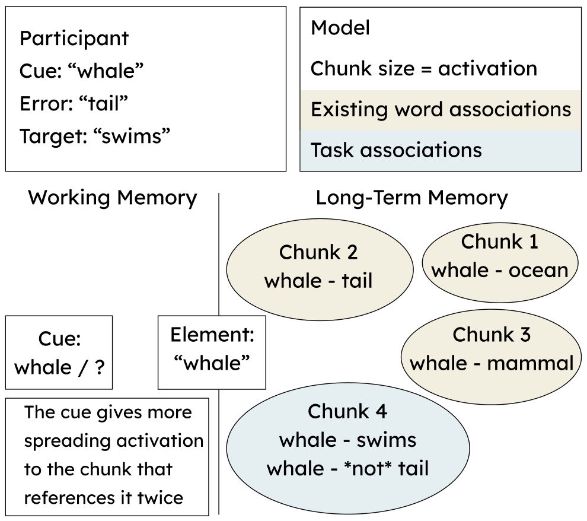
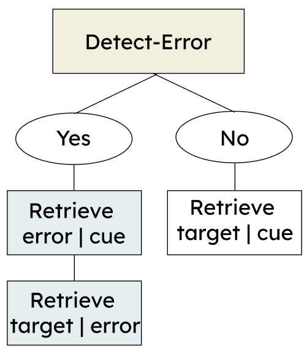
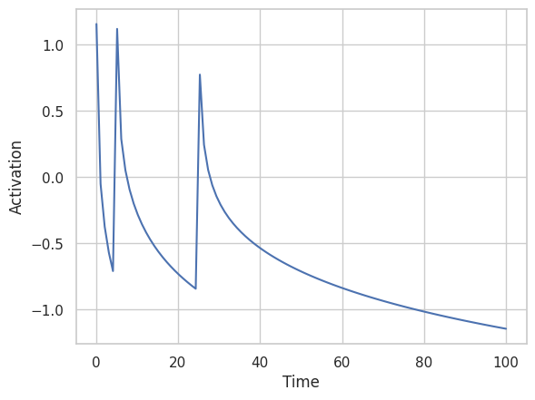
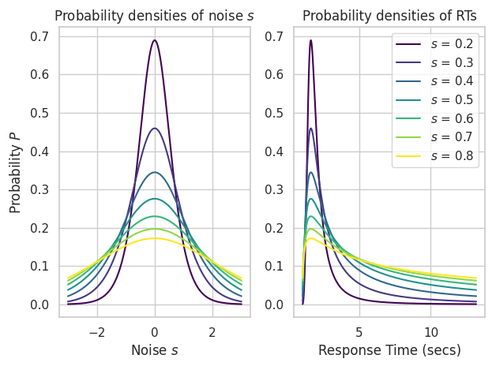

```{r setup, include=FALSE}
# Data manipulation and analysis
library(dplyr)
library(tidyr)
library(readxl)
library(PairedData)
library(hash)
library(rlang)
library(plotrix)

library(lme4)      # Mixed models
library(lmerTest)  # Summary and p-values for mixed models
library(sjPlot)   # APA-style tables for mixed models
library(broom.mixed)
library(ggsci)
library(reticulate)
# use_python("/Users/bridget/anaconda3/bin/python3")
# Switch python for windows
use_python("C:\\Users\\Bridget Leonard\\AppData\\Local\\Programs\\Python\\Python312")

# Graphics
library(ggplot2)
library(plotly)
library(gridExtra)     
library(knitr)
library(imager)

# Tables
library(kableExtra)

# Dashboard
library(shiny)
library(flexdashboard)
# Install thematic and un-comment for themed static plots (i.e., ggplot2)
# thematic::thematic_rmd()
```


```{r}
# Load data:
errors <- read_excel("behavioral_data/error_data.xlsx")
```


```{r}
# Remove error items that were correctly guessed during the learning phase
study_items <- errors %>% 
  subset(condition == 2)

guess <- errors %>% 
  subset(phase == "learn" & condition == 1 & correct!=1) %>% 
  dplyr::select(participant, cue)

clean_errors <- left_join(guess, errors, by = c("participant", "cue")) %>% 
  filter(phase == "test") %>% 
  full_join(study_items, by = c("participant", "cue", "phase", "condition", "target", "response", "rt", "correct", "Column1", "Column2"))

```

```{r}
cleandata <- clean_errors %>% filter(rt > 200, rt < 15000)
```

```{r}
cleandata <- cleandata %>%  
  mutate(condition = replace(condition, condition == 1, "error")) %>% 
  mutate(condition = replace(condition, condition == 2, "study")) %>%
  mutate(correct = replace(correct, correct == 2, 0))
```

```{r}
# Mixed Linear Model
acc_model <- glmer(correct ~ condition # Fixed effect of condition
                   + (1|participant),  # Interface for participant
                   family=binomial, 
                   cleandata)
```

```{r}
acc_model_simple <- glm(correct ~ condition, # Fixed effect of condition
                        family=binomial, 
                        cleandata)

acc_model_complex <- glmer(correct ~ condition # Fixed effect of condition
                           + (1|participant)  # Interface for participant
                           + (0 + condition|participant),
                           family=binomial, 
                           cleandata)

```


```{r}
# Response Times
cleandata_rt <- cleandata %>% filter(correct == 1)
```

```{r}
rt_model <- lmer(rt ~ condition # Fixed effect of condition 
                 + (1|participant),   # Random intercept of participant
                 #+ (0 + condition|participant),  # Random slope for participant 
                 cleandata_rt)
```

```{r message=FALSE}
rt_model_simple <- lm(rt ~ condition, cleandata_rt)

rt_model_complex <- lmer(rt ~ condition # Fixed effect of condition 
                         + (1|participant)   # Random intercept of participant
                         + (0 + condition|participant),  # Random slope for participant 
                         cleandata_rt)

```

```{r}
lldata <- read.csv("LL_model1.csv")
lldata <- lldata %>% 
  filter(X != 61)
```


```{r message=FALSE, warning=FALSE}
cleandata <- cleandata %>% mutate(pred_correct = fitted(acc_model))

cleandata %>% pivot_longer(cols=c("correct", "pred_correct"),
                           values_to = "accuracy",
                           names_to = "type") -> cleandata_long

cleandata_agg_pred <- cleandata_long %>% 
  mutate(type = replace(type, type == "correct",  "Observed")) %>% 
  mutate(type = replace(type, type == "pred_correct", "Predicted")) %>%
  group_by(participant, condition, type) %>%
  summarise(Accuracy = mean(accuracy))

cleandata_summary_pred <- cleandata_agg_pred %>% 
  group_by(condition, type) %>%
  summarise(Accuracy = mean(Accuracy))

cleandata_agg_pred <- cleandata_agg_pred %>% 
  mutate(cond = case_when(condition == "study" ~ 1, condition == "error" ~ 2)) %>% 
  mutate(cond = jitter(cond))

cleandata_summary_pred <- cleandata_summary_pred %>% 
  mutate(cond = case_when(condition == "study" ~ 1, condition == "error" ~ 2))

Ose_data <- cleandata_agg_pred %>% 
  filter(type == "Observed") %>% 
  group_by(condition) %>% 
  summarize(
    accuracy_se = std.error(Accuracy)
  )
Pse_data <- cleandata_agg_pred %>% 
  filter(type == "Predicted") %>% 
  group_by(condition) %>% 
  summarize(
    accuracy_se = std.error(Accuracy)
  )

p1 <- plot_ly(data = cleandata_agg_pred %>% filter(type=="Observed") %>% group_by(participant), x = ~cond, y = ~Accuracy, color = ~condition) %>%
  add_markers(alpha = 0.75, color = I("#D9D6C7"), split = ~participant, marker = list(size=5),
              text = ~Accuracy,
              textposition = "auto",
              hoverinfo = "text",
              hovertext = ~paste0("Participant: ", participant,
                                "<br> Observed Accuracy: ", round(Accuracy*100, 2), "%"),
              legendgroup="participants", name=~paste("Participant -", participant)) %>% 
  add_lines(color = I("#D9D6C7"), line = list(width = 0.3), split = ~participant,
            legendgroup="participants", name=~paste("Participant -", participant),
            showlegend=FALSE) %>%
  add_markers(data = cleandata_summary_pred %>% filter(type =="Observed") %>% full_join(Ose_data, by="condition") %>%  filter(condition=="error"), x = ~cond, y = ~Accuracy, error_y = list(type= "data", array = ~accuracy_se,color = '#BF8173', thickness=1), type = "scatter", mode = "markers", marker = list(color = "#BF8173", size = 8), legendgroup="average",
              name="Average - Error") %>% 
  add_markers(data = cleandata_summary_pred %>% filter(type =="Observed") %>% full_join(Ose_data, by="condition") %>%  filter(condition=="study"), x = ~cond, y = ~Accuracy, error_y = list(type= "data", array = ~accuracy_se,color = '#9EB972', thickness=1), type = "scatter", mode = "markers", marker = list(color = "#9EB972", size = 8), legendgroup="average",
              name="Average - Study") %>% 
  add_text(data = cleandata_summary_pred %>% filter(condition == "error" & type =="Observed"), x = ~cond, y = ~Accuracy, text = ~paste0(round(Accuracy * 100, 2), "%"), hjust = -0.5, textfont=list(color = c("#BF8173"), size=16), legendgroup="average",
              name="Average - Error", showlegend=FALSE) %>%
  add_text(data = cleandata_summary_pred %>% filter(condition == "study" & type =="Observed"), x = ~cond, y = ~Accuracy, text = ~paste0(round(Accuracy * 100, 2), "%"), hjust = -0.2, textfont=list(color = c("#9EB972"), size=16), legendgroup="average",
              name="Average - Study", showlegend=FALSE) %>%
  style(textposition = "top right") %>%
  layout(
    title = "Mean Differences in Accuracy",
    xaxis = list(title = "Condition", autotypenumbers = "strict", range = c(0.5, 2.5), ticktext = list("Study", "Error"), 
      tickvals = list(1, 2),
      tickmode = "array"),
    yaxis = list(title = "Accuracy"),
    legend = list(traceorder='reversed'),
    showlegend = TRUE,
    hovermode = "closest"
  ) 

p2 <- plot_ly(data = cleandata_agg_pred %>% filter(type=="Predicted") %>% group_by(participant), x = ~cond, y = ~Accuracy, color = ~condition) %>%
  add_markers(alpha = 0.75, color = I("#D9D6C7"), split = ~participant, marker = list(size=5),
              text = ~Accuracy,
              textposition = "auto",
              hoverinfo = "text",
              hovertext = ~paste0("Participant: ", participant,
                                "<br> Predicted Accuracy: ", round(Accuracy*100, 2), "%"),
              legendgroup="participants", name=~paste("Participant -", participant),
              showlegend=FALSE) %>% 
  add_lines(color = I("#D9D6C7"), line = list(width = 0.3), split = ~participant,
            legendgroup="participants", name=~paste("Participant -", participant),
            showlegend=FALSE) %>%
  add_markers(data = cleandata_summary_pred %>% filter(type =="Predicted") %>% full_join(Pse_data, by="condition") %>%  filter(condition=="error"), x = ~cond, y = ~Accuracy, error_y = list(type= "data", array = ~accuracy_se,color = '#BF8173', thickness=1), type = "scatter", mode = "markers", marker = list(color = "#BF8173", size = 8), legendgroup="average",
              name="Average - Error", showlegend=FALSE) %>% 
  add_markers(data = cleandata_summary_pred %>% filter(type =="Predicted") %>% full_join(Pse_data, by="condition") %>%  filter(condition=="study"), x = ~cond, y = ~Accuracy, error_y = list(type= "data", array = ~accuracy_se,color = '#9EB972', thickness=1), type = "scatter", mode = "markers", marker = list(color = "#9EB972", size = 8), legendgroup="average",
              name="Average - Study", showlegend=FALSE) %>% 
  add_text(data = cleandata_summary_pred %>% filter(condition == "error" & type =="Predicted"), x = ~cond, y = ~Accuracy, text = ~paste(round(Accuracy * 100, 2), "%"), hjust = -0.5, textfont=list(color = c("#BF8173"), size=16), legendgroup="average",
              name="Average - Error", showlegend=FALSE) %>%
  add_text(data = cleandata_summary_pred %>% filter(condition == "study" & type =="Predicted"), x = ~cond, y = ~Accuracy, text = ~paste(round(Accuracy * 100, 2), "%"), hjust = -0.2, textfont=list(color = c("#9EB972"), size=16), legendgroup="average",
              name="Average - Study", showlegend=FALSE) %>%
  style(textposition = "top right") %>%
  layout(
    title = "Mean Differences in Accuracy",
    xaxis = list(title = "Condition", autotypenumbers = "strict", ticks="inside", range = c(0.5, 2.5), ticktext = list("Study", "Error"), 
      tickvals = list(1, 2),
      tickmode = "array"),
    yaxis = list(title = "Accuracy"),
    legend = list(traceorder='reversed'),
    showlegend = TRUE,
    hovermode = "closest"
  ) 

annotations = list( 
  list( 
    x = 0.2,  
    y = 0.95,  
    size = 12,
    text = "Observed",  
    xref = "paper",  
    yref = "paper",  
    xanchor = "center",  
    yanchor = "bottom",  
    showarrow = FALSE 
  ),  
  list( 
    x = 0.8,  
    y = 0.95,  
    size = 12,
    text = "Predicted",  
    xref = "paper",  
    yref = "paper",  
    xanchor = "center",  
    yanchor = "bottom",  
    showarrow = FALSE 
  ))

accPlotly <- subplot(p1, p2, shareX = TRUE, shareY=TRUE) %>%  layout(annotations=annotations)
```

```{r}
# reg RT plot
cleandata_rt <- cleandata_rt %>% mutate(pred_rt = fitted(rt_model))

cleandata_rt %>% pivot_longer(cols=c("rt", "pred_rt"),
                              values_to = "RT",
                              names_to = "type") -> cleandata_rt_long

cleandata_rt_agg_pred <- cleandata_rt_long %>% 
  mutate(type = replace(type, type == "rt",  "Observed")) %>% 
  mutate(type = replace(type, type == "pred_rt", "Predicted")) %>%
  group_by(participant, condition, type) %>%
  summarise(RT = mean(RT))

cleandata_rt_summary_pred <- cleandata_rt_agg_pred %>% 
  group_by(condition, type) %>%
  summarise(RT = mean(RT))

rtPlot <- ggplot(cleandata_rt_agg_pred, aes(x=condition, y=RT, color=condition)) +
  facet_wrap(~ type) +
  geom_line(color="grey", aes(group=participant), size=0.1) +
  geom_point(position =   position_jitter(width=0.1), alpha=0.75, color="grey") +
  # scale_color_aaas() +
  scale_color_manual(values=c("#BF8173", "#9EB972")) +
  
  geom_text(data=cleandata_rt_summary_pred, 
            aes(x=condition, 
                y=RT, 
                label=paste(round(RT), "ms")), size=4.5,
            hjust= c(-0.2)) +
  ggtitle("Mean Differences in Response Times") +
  xlab("Condition") +
  stat_summary(geom="point", fun.data = "mean_se", size=3) +
  stat_summary(geom="errorbar", fun.data = "mean_se", width=0.1) +
  labs(color = "Condition") +
  theme_minimal() +
theme(legend.position = c(0, 1), 
      legend.background = element_rect(fill="white",size=0.2, 
                                       linetype="solid", colour ="lightgrey"),
      text = element_text(size=15),
      plot.title = element_text(hjust = 0.5))

cleandata_rt_agg_pred <- cleandata_rt_agg_pred %>% 
  mutate(cond = case_when(condition == "study" ~ 1, condition == "error" ~ 2)) %>% 
  mutate(cond = jitter(cond))

cleandata_rt_summary_pred <- cleandata_rt_summary_pred %>% 
  mutate(cond = case_when(condition == "study" ~ 1, condition == "error" ~ 2))

Ort_data <- cleandata_rt_agg_pred %>% 
  filter(type == "Observed") %>% 
  group_by(condition) %>% 
  summarize(
    rt_se = std.error(RT)
  )

Prt_data <- cleandata_rt_agg_pred %>% 
  filter(type == "Predicted") %>% 
  group_by(condition) %>% 
  summarize(
    rt_se = std.error(RT)
  )

rt1 <- plot_ly(data = cleandata_rt_agg_pred %>% filter(type=="Observed") %>% group_by(participant), x = ~cond, y = ~RT, color = ~condition) %>%
  add_markers(position = "jitter", alpha = 0.75, color = I("#D9D6C7"), split = ~participant, marker = list(size=3),
              text = ~RT,
              textposition = "auto",
              hoverinfo = "text",
              hovertext = ~paste0("Participant: ", participant,
                                "<br> Observed RT: ", round(RT), " ms"),
              legendgroup="participants", name=~paste("Participant -", participant)) %>% 
  add_lines(color = I("#D9D6C7"), line = list(width = 0.3), split = ~participant,
            legendgroup="participants", name=~paste("Participant -", participant),
            showlegend=FALSE) %>%
  add_markers(data = cleandata_rt_summary_pred %>% filter(type =="Observed") %>% full_join(Ort_data, by="condition") %>%  filter(condition=="error"), x = ~cond, y = ~RT, error_y = list(type= "data", array = ~rt_se,color = '#BF8173', thickness=1), type = "scatter", mode = "markers", marker = list(color = "#BF8173", size = 8), legendgroup="average",
              name="Average - Error") %>% 
  add_markers(data = cleandata_rt_summary_pred %>% filter(type =="Observed") %>% full_join(Ort_data, by="condition") %>%  filter(condition=="study"), x = ~cond, y = ~RT, error_y = list(type= "data", array = ~rt_se,color = '#9EB972', thickness=1), type = "scatter", mode = "markers", marker = list(color = "#9EB972", size = 8), legendgroup="average",
              name="Average - Study") %>% 
  add_text(data = cleandata_rt_summary_pred %>% filter(condition == "error" & type =="Observed"), x = ~cond, y = ~RT, text = ~paste(round(RT), "ms"), hjust = -0.5, textfont=list(color = c("#BF8173"), size=16), legendgroup="average",
              name="Average - Error", showlegend=FALSE) %>%
  add_text(data = cleandata_rt_summary_pred %>% filter(condition == "study" & type =="Observed"), x = ~cond, y = ~RT, text = ~paste(round(RT), "ms"), hjust = -0.2, textfont=list(color = c("#9EB972"), size=16), legendgroup="average",
              name="Average - Study", showlegend=FALSE) %>%
  style(textposition = "top right") %>%
  layout(
    title = "Mean Differences in Response Times",
    xaxis = list(title = "Condition", autotypenumbers = "strict", ticks="inside", range = c(0.5, 2.5), ticktext = list("Study", "Error"), 
      tickvals = list(1, 2),
      tickmode = "array"),
    yaxis = list(title = "Response Times"),
    legend = list(traceorder = "reversed"),
    showlegend = TRUE,
    hovermode = "closest"
  ) 

rt2 <- plot_ly(data = cleandata_rt_agg_pred %>% filter(type=="Predicted") %>% group_by(participant), x = ~cond, y = ~RT, color = ~condition) %>%
  add_markers(position = "jitter", alpha = 0.75, color = I("#D9D6C7"), split = ~participant, marker = list(size=3),
              text = ~RT,
              textposition = "auto",
              hoverinfo = "text",
              hovertext = ~paste0("Participant: ", participant,
                                "<br> Predicted RT: ", round(RT), " ms"),
            legendgroup="participants", name=~paste("Participant -", participant),
            showlegend=FALSE) %>% 
  add_lines(color = I("#D9D6C7"), line = list(width = 0.3), split = ~participant,
            legendgroup="participants", name=~paste("Participant -", participant),
            showlegend=FALSE) %>%
  add_markers(data = cleandata_rt_summary_pred %>% filter(type =="Predicted") %>% full_join(Prt_data, by="condition") %>%  filter(condition=="error"), x = ~cond, y = ~RT, error_y = list(type= "data", array = ~rt_se,color = '#BF8173', thickness=1), type = "scatter", mode = "markers", marker = list(color = "#BF8173", size = 8), legendgroup="average",
              name="Average - Error", showlegend=FALSE) %>% 
  add_markers(data = cleandata_rt_summary_pred %>% filter(type =="Predicted") %>% full_join(Prt_data, by="condition") %>%  filter(condition=="study"), x = ~cond, y = ~RT, error_y = list(type= "data", array = ~rt_se,color = '#9EB972', thickness=1), type = "scatter", mode = "markers", marker = list(color = "#9EB972", size = 8), legendgroup="average",
              name="Average - Study", showlegend=FALSE) %>% 
  add_text(data = cleandata_rt_summary_pred %>% filter(condition == "error" & type =="Predicted"), x = ~cond, y = ~RT, text = ~paste(round(RT), "ms"), hjust = -0.5, textfont=list(color = c("#BF8173"), size=16), legendgroup="average",
              name="Average - Error", showlegend=FALSE) %>%
  add_text(data = cleandata_rt_summary_pred %>% filter(condition == "study" & type =="Predicted"), x = ~cond, y = ~RT, text = ~paste(round(RT), "ms"), hjust = -0.2, textfont=list(color = c("#9EB972"), size=16), legendgroup="average",
              name="Average - Study", showlegend=FALSE) %>%
  style(textposition = "top right") %>%
  layout(
    title = "Mean Differences in Response Times",
    xaxis = list(title = "Condition", autotypenumbers = "strict", ticks="inside", range = c(0.5, 2.5), ticktext = list("Study", "Error"), 
      tickvals = list(1, 2),
      tickmode = "array"),
    yaxis = list(title = "Response Times"),
    legend = list(traceorder = "reversed"),
    showlegend = TRUE,
    hovermode = "closest"
  ) 


rtPlotly <- subplot(rt1, rt2, shareX = TRUE, shareY=TRUE) %>%  layout(annotations=annotations)

```

```{r}
# Random RT plot
cleandata_rt <- cleandata_rt %>% mutate(pred_rt = fitted(rt_model_complex))

cleandata_rt %>% pivot_longer(cols=c("rt", "pred_rt"),
                              values_to = "RT",
                              names_to = "type") -> cleandata_rt_long

cleandata_rt_agg_pred <- cleandata_rt_long %>% 
  mutate(type = replace(type, type == "rt",  "Observed")) %>% 
  mutate(type = replace(type, type == "pred_rt", "Predicted")) %>%
  group_by(participant, condition, type) %>%
  summarise(RT = mean(RT))

cleandata_rt_summary_pred <- cleandata_rt_agg_pred %>% 
  group_by(condition, type) %>%
  summarise(RT = mean(RT))

cleandata_rt_agg_pred <- cleandata_rt_agg_pred %>% 
  mutate(cond = case_when(condition == "study" ~ 1, condition == "error" ~ 2)) %>% 
  mutate(cond = jitter(cond))

cleandata_rt_summary_pred <- cleandata_rt_summary_pred %>% 
  mutate(cond = case_when(condition == "study" ~ 1, condition == "error" ~ 2))

Ort_data <- cleandata_rt_agg_pred %>% 
  filter(type == "Observed") %>% 
  group_by(condition) %>% 
  summarize(
    rt_se = std.error(RT)
  )

Prt_data <- cleandata_rt_agg_pred %>% 
  filter(type == "Predicted") %>% 
  group_by(condition) %>% 
  summarize(
    rt_se = std.error(RT)
  )

rand1 <- plot_ly(data = cleandata_rt_agg_pred %>% filter(type=="Observed") %>% group_by(participant), x = ~cond, y = ~RT, color = ~condition) %>%
  add_markers(position = "jitter", alpha = 0.75, color = I("#D9D6C7"), split = ~participant, marker = list(size=3),
              text = ~RT,
              textposition = "auto",
              hoverinfo = "text",
              hovertext = ~paste0("Participant: ", participant,
                                "<br> Observed RT: ", round(RT), " ms"),
            legendgroup="participants", name=~paste("Participant -", participant)) %>% 
  add_lines(color = I("#D9D6C7"), line = list(width = 0.3), split = ~participant,
            legendgroup="participants", name=~paste("Participant -", participant),
            showlegend=FALSE) %>%
  add_markers(data = cleandata_rt_summary_pred %>% filter(type =="Observed") %>% full_join(Ort_data, by="condition") %>%  filter(condition=="error"), x = ~cond, y = ~RT, error_y = list(type= "data", array = ~rt_se,color = '#BF8173', thickness=1), type = "scatter", mode = "markers", marker = list(color = "#BF8173", size = 8), legendgroup="average",
              name="Average - Error") %>% 
  add_markers(data = cleandata_rt_summary_pred %>% filter(type =="Observed") %>% full_join(Ort_data, by="condition") %>%  filter(condition=="study"), x = ~cond, y = ~RT, error_y = list(type= "data", array = ~rt_se,color = '#9EB972', thickness=1), type = "scatter", mode = "markers", marker = list(color = "#9EB972", size = 8), legendgroup="average",
              name="Average - Study") %>% 
  add_text(data = cleandata_rt_summary_pred %>% filter(condition == "error" & type =="Observed"), x = ~cond, y = ~RT, text = ~paste(round(RT), "ms"), hjust = -0.5, textfont=list(color = c("#BF8173"), size=16), legendgroup="average",
              name="Average - Error", showlegend=FALSE) %>%
  add_text(data = cleandata_rt_summary_pred %>% filter(condition == "study" & type =="Observed"), x = ~cond, y = ~RT, text = ~paste(round(RT), "ms"), hjust = -0.2, textfont=list(color = c("#9EB972"), size=16), legendgroup="average",
              name="Average - Study", showlegend=FALSE) %>%
  style(textposition = "top right") %>%
  layout(
    title = "Mean Differences in Response Times (with Random Slopes)",
    xaxis = list(title = "Condition", autotypenumbers = "strict", ticks="inside", range = c(0.5, 2.5), ticktext = list("Study", "Error"), 
      tickvals = list(1, 2),
      tickmode = "array"),
    yaxis = list(title = "Response Times"),
    legend = list(traceorder = "reversed"),
    showlegend = TRUE,
    hovermode = "closest"
  ) 

rand2 <- plot_ly(data = cleandata_rt_agg_pred %>% filter(type=="Predicted") %>% group_by(participant), x = ~cond, y = ~RT, color = ~condition) %>%
  add_markers(position = "jitter", alpha = 0.75, color = I("#D9D6C7"), split = ~participant, marker = list(size=3),
              text = ~RT,
              textposition = "auto",
              hoverinfo = "text",
              hovertext = ~paste0("Participant: ", participant,
                                "<br> Predicted RT: ", round(RT), " ms"),
            legendgroup="participants", name=~paste("Participant -", participant),
            showlegend=FALSE) %>% 
  add_lines(color = I("#D9D6C7"), line = list(width = 0.3), split = ~participant,
            legendgroup="participants", name=~paste("Participant -", participant),
            showlegend=FALSE) %>%
  add_markers(data = cleandata_rt_summary_pred %>% filter(type =="Predicted") %>% full_join(Prt_data, by="condition") %>%  filter(condition=="error"), x = ~cond, y = ~RT, error_y = list(type= "data", array = ~rt_se,color = '#BF8173', thickness=1), type = "scatter", mode = "markers", marker = list(color = "#BF8173", size = 8), legendgroup="average",
              name="Average - Error", showlegend=FALSE) %>% 
  add_markers(data = cleandata_rt_summary_pred %>% filter(type =="Predicted") %>% full_join(Prt_data, by="condition") %>%  filter(condition=="study"), x = ~cond, y = ~RT, error_y = list(type= "data", array = ~rt_se,color = '#9EB972', thickness=1), type = "scatter", mode = "markers", marker = list(color = "#9EB972", size = 8), legendgroup="average",
              name="Average - Study", showlegend=FALSE) %>% 
  add_text(data = cleandata_rt_summary_pred %>% filter(condition == "error" & type =="Predicted"), x = ~cond, y = ~RT, text = ~paste(round(RT), "ms"), hjust = -0.5, textfont=list(color = c("#BF8173"), size=16), legendgroup="average",
              name="Average - Error", showlegend=FALSE) %>%
  add_text(data = cleandata_rt_summary_pred %>% filter(condition == "study" & type =="Predicted"), x = ~cond, y = ~RT, text = ~paste(round(RT), "ms"), hjust = -0.2, textfont=list(color = c("#9EB972"), size=16), legendgroup="average",
              name="Average - Study", showlegend=FALSE) %>%
  style(textposition = "top right") %>%
  layout(
    title = "Mean Differences in Response Times (with Random Slopes)",
    xaxis = list(title = "Condition", autotypenumbers = "strict", ticks="inside", range = c(0.5, 2.5), ticktext = list("Study", "Error"), 
      tickvals = list(1, 2),
      tickmode = "array"),
    yaxis = list(title = "Response Times"),
    legend = list(traceorder = "reversed"),
    showlegend = TRUE,
    hovermode = "closest"
  ) 


randPlotly <- subplot(rand1, rand2, shareX = TRUE, shareY=TRUE) %>%  layout(annotations=annotations)

```

Introduction
===========================================================
Column {data-width=600}
-----------------------------------------------------------------------
### Overview
```{r}
HTML("<br>")
HTML('<center></center>')
HTML("<br> <br>")

HTML("In this project, we explore the differences in accuracies and reaction times between error-generation and study items in a task. Using behavioral data analysis, we aim to identify the underlying mechanisms of error learning and how it affects performance.
<br><br>
We have also built computational cognitive models with the <i>ACT-R architecture</i> that reflect different mechanisms of error learning. By comparing these models, we aim to determine which one best describes the phenomenon of error learning. Using a Python adaptation of ACT-R we were able to create these models in an optimized environment. The fit of the two models was compared by estimating their log-likelihoods given the data. Thus, we were able to calculate the fit of each for each participant for each of their trials to comprehensively assess error learning.
<br><br>
<b>Findings support a mediator method of error learning, where people recall their error on subsequent fact presentations and use it to retrieve the correct answer.</b>
<br><br>
This project has the potential to shed light on the cognitive processes involved in error learning and can have implications for improving learning and training strategies. Thank you for your interest in our project.")
```


Column {.tabset .tabset-fade data-width=400}
-----------------------------------------------------------------------

### Elaborative Hypothesis
```{r}
HTML('<center></center>')

HTML("<br>
The <b>elaborative hypothesis</b> posits that related errors increase learning by activating the semantic network between cue and target, creating a more meaningful story behind the fact. <br> 
     <br>
     In ACT-R, this can be modeled through <i>spreading activation</i>. Cues give more spreading activation to error memories (more elaborative chunks) than study chunks.")

```

### Mediator Hypothesis
```{r}
HTML('<center></center>')

HTML("<br>
The <b>mediator hypothesis</b> posits that errors are used as a secondary cue to retrieve the correct answer. <br>
<br>
     In ACT-R, this can be modeled through the procedural module. An <i>additional production</i> rule recalls an error, increasing specificity when retrieving the correct answer.")
```

Mixed Linear Models
===========================================================

Sidebar {.sidebar data-width=250}
-----------------------------------------------------------------------

Mixed Linear Models were created to account for variability and individual 
differences in the collected behavioral data. We fit mixed models for both accuracy
and response times to see differences between conditions (study vs. error).

```{r}
selectInput("y", label = "Data Type",
            choices = c("Accuracy" = "accuracy", "Response Times" = "rt"), selected = "Accuracy")

selectInput("slope", label = "Random Slope (for RTs)",
            choices = c("No" = "no", "Yes" = "yes"), selected = "No")
```

Column
-----------------------------------------------------------------------

### Results

```{r message=FALSE}
renderPlotly({
   if(input$y == "accuracy") return(accPlotly)   
   if(input$y == "rt" & input$slope == "no") return(rtPlotly)
   if(input$y == "rt" & input$slope == "yes") return(randPlotly)
})
```


ACT-R Models
===========================================================

Column {data-width=450}
-------------------------------------
    
### Implementing ACT-R in Python
Activation (Equation 1)
```{python}
import numpy as np
import scipy as sp
import math
```

```{python, echo = TRUE}
def activation(traces, time, decay):
    """Computes the activation of a memory given its 
    history of retrievals"""
    ftraces = [x for x in traces if x < time]
    decay = max(0, decay)  # No positive decay rates 
    decay - min(decay, 5)
    times = time - np.array(ftraces)
    odds = times ** -decay
    return np.log(np.sum(odds))
```

```{python, echo= TRUE}
activation([5, 10, 15], 40, 0.5)
```
   
Response Time (Equation 2)
```{python, echo=TRUE}
def responsetime(activation, ter, F=1, f=1):
    return ter + F * np.exp(-f * activation)

responsetime(-0.5, 1)
```

Column {.tabset .tabset-fade}
-------------------------------------
 
### Response Probabilities
```{r}
HTML('<center></center>')
```

We can calculate the probability that each item in declarative memory 
will be retrieved given activations using the Boltzmann equation. Thus, 
transforming activations to response probabilities:
```{python, echo = TRUE}
def boltzmann(options, values, temperature):
    """Returns a Boltzmann distribution of probabilities"""
    temperature = max(temperature, 0.01) 
    vals = np.array(values)/temperature
    bvals = np.exp(vals - np.max(vals)) / np.exp(vals - 
      np.max(vals)).sum()
    return dict(zip(options, bvals))
``` 
For example, the probabilities of choosing between "2" or "3" with respective values of 1 and 0.7 and noise = 1
```{python}
accpr = boltzmann([2,3], [1, 0.7], 1)
print("boltzmann([2,3], [1, 0.7], 1):", accpr)
```

### Response Time Probabilities
ACT-R declarative memory noise (s) follows a logistic distribution: mean = 0 and sd = π*s/√3. Applying equation 2 to the probability density function of s gives the probability density function of different RTs:
```{r}
HTML('<center></center>')
```

```{python, echo=TRUE}
def rtProb(rt, activation, s, ter):
  """Takes one parameter for noise, s, and outputs a 
  probability distribution for response times"""
  noise = np.linspace(-2, 2)
  dist = sp.stats.logistic(0, ((math.pi*s)/math.sqrt(3)))
  rts = [responsetime((activation - x), ter) for x in noise]
  prob = dist.pdf(noise)
  rtprob = {rts[i]:prob[i]for i in range(len(noise))}
  val = min(rtprob.keys(), key=lambda x: abs(x - (rt/1000)))
  return rtprob[val]
```

```{python}
rtp = rtProb(5030, 3, 1, 1)
print("rtProb(5030, 3, 1, 1):", rtp)
```

Model Fit with Log-likelihood
===========================================================

Column {data-width=450}
-------------------------------------------------------------
### Loglikelihood Calculations

Although they fit individual data, MLM models don't capture the nonlinear dynamics of memory. So, we implemented the two hypotheses with ACT-R models and used convex optimization techniques to maximize their fit to every individual. The fit of the two models was compared by estimating their likelihoods given the data. The likelihood of a model M given a vector of data x, L(M|x), is the probability of observing the data, given M: L(M|x) = P(x|M). Our data consists of multiple independent responses x1, x2, …, xN, thus

L(M|x) = P(x1|M) ⋅ P(x2|M) ⋅ … ⋅ P(xN|M) = ∏i P(xi|M)

Because the product of probabilities becomes very small, it is common to use log-likelihood:

log L(M|x) = log ∏i P(xi|M) = ∑i log P(xi|M)

In our case, each model was jointly fitted to two behavioral measures: The responses x and its corresponding response time RT using the probability distributions discussed

```{r}
HTML("<b>The cumulative difference in log-likelihood between the two models is 1,728. Because of the definition of log-likelihood, this difference indicates an odds ratio of <sup>1,728</sup>, indicating that <i>the mediator model is e<sup>1,728</sup> more likely to fit the data than the elaborative model</i></b>")
```
Column 
-------------------------------------------------------------
### Results

```{r}
lldata <- read.csv("LL_model1.csv")
lldata <- lldata %>% 
  filter(X != 61)
```

```{r}
mean <- mean(lldata$diff.LL)

elabMean <- lldata %>% 
  filter(best.model == "Elaborative") %>% 
  pull(diff.LL) %>% 
  mean()

plot_ly() %>% 
  add_trace(data = lldata %>% filter(best.model=="Mediator"), x=~diff.LL, type='histogram', nbinsx=30, marker=list(color = "#7AB3BF"),
            values = ~diff.LL, 
            hovertemplate = "<b><i>Learner:</i></b> Mediator <br> <b><i>Difference in Model Fit:</i></b> %{x} <br>  <b><i>Count:</i></b> %{y}",
            name = "Mediator"
  ) %>% 
  add_trace(data = lldata %>% filter(best.model=="Elaborative"), x=~diff.LL, type='histogram', nbinsx=30, marker=list(color = "#A65851"),
            values = ~diff.LL, 
            hovertemplate = "<b><i>Learner:</i></b> Elaborative <br> <b><i>Difference in Model Fit:</i></b> %{x} <br>  <b><i>Count:</i></b> %{y}",
            name = "Elaborative"
  ) %>% 
  add_segments(x=0, xend=0, y=0, yend=17, line = list(dash = "dash", color = '#BF8173'),inherit = FALSE, showlegend = FALSE,
               hovertemplate = "<b><i>Difference is %{x}</i></b> <br> Represents where neither model fits a particpant better") %>% 
  add_segments(x=27.9, xend=27.9, y=0, yend=17, line = list(dash = "dash", color = '#734439'),inherit = FALSE, showlegend = FALSE,
               hovertemplate = "<b><i>Difference is %{x}</i></b> <br> Indicates mean difference of fit across all models") %>% 
  layout(
    legend=list(title=list(text="Learner Type")),
    xaxis = list(title = "log<i>L(M<sub>Mediator</sub>)</i> - log<i>L(M<sub>Elaborative</sub>)</i>"), 
    yaxis = list(title = "Number of Participants")
  )

```